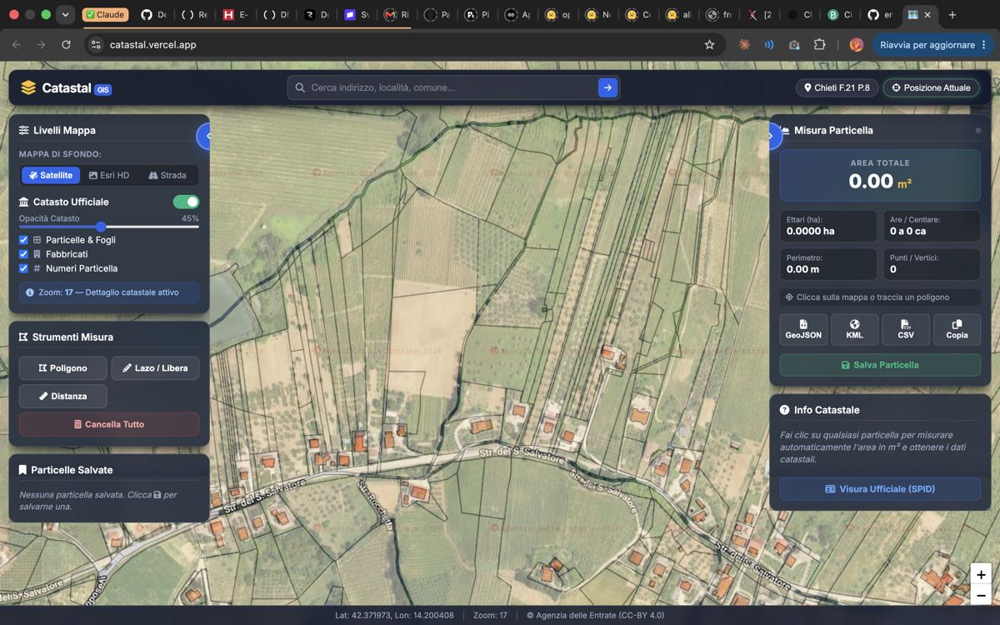

<div align="center">
  <h1>🗺️ Catastal GIS</h1>
  <p><strong>Applicazione WebGIS open-source per la consultazione e misurazione delle particelle catastali in Italia.</strong></p>

  [](https://catastal.vercel.app/)
  [](https://opensource.org/licenses/MIT)
</div>

<br>

<div align="center">
  <a href="https://catastal.vercel.app/"><strong>🌍 Prova la Live Demo qui!</strong></a>
</div>

<br>

## 📸 Anteprima
<div align="center">
  
</div>

---

## ✨ Funzionalità Principali

- 🛰️ **Mappe Ibride ad Alta Risoluzione**: Scegli tra Google Satellite, Esri HD o mappa stradale OpenStreetMap.
- 🏛️ **Catasto in Tempo Reale**: Sovrapposizione ufficiale dei dati dell'Agenzia delle Entrate tramite WMS (fogli, particelle, fabbricati).
- 🖱️ **Click-to-Measure (WFS)**: Clicca su qualsiasi terreno per estrarre la geometria esatta dal server WFS ministeriale e calcolarne l'area (m², ettari, are/centiare).
- 📐 **Strumenti di Disegno Avanzati**: Traccia poligoni a mano, usa il lazo o misura distanze con precisione millimetrica.
- 📍 **Geolocalizzazione GPS**: Trova la tua posizione attuale con cerchio di precisione integrato.
- 💾 **Salvataggio Locale**: Salva le misurazioni importanti per non perderle.
- 📊 **Esportazione Multi-Formato**: Scarica i dati in **GeoJSON**, **KML** (per Google Earth) o **CSV**.
- 🪪 **Integrazione SPID**: Link diretto e precompilato al portale dell'Agenzia delle Entrate per visure ufficiali.

## 🚀 Tecnologie Utilizzate

- **Frontend**: HTML5, CSS3 (Glassmorphism UI), JavaScript ES6+
- **Librerie Cartografiche**: [Leaflet.js](https://leafletjs.com/), [Geoman](https://geoman.io/), [Turf.js](https://turfjs.org/) (geometrie), Proj4Leaflet (per EPSG:6706).
- **Backend (Proxy)**: Node.js, Express, Axios, `xml2js`.
- **Integrazioni**: API WMS/WFS Agenzia delle Entrate (CC-BY 4.0), API Nominatim (OSM).

## 🛠️ Installazione Locale

Vuoi far girare il progetto sul tuo computer?

1. **Clona la repository**:
   ```bash
   git clone https://github.com/emanuelediluzio/catastal.git
   cd catastal
   ```

2. **Installa le dipendenze**:
   ```bash
   npm install
   ```

3. **Avvia il server**:
   ```bash
   npm start
   ```
   L'app sarà disponibile su `http://localhost:3000`.

## 🧠 Note di Architettura (Vercel)

L'applicazione comunica con i servizi cartografici ministeriali. Poiché le API dell'Agenzia delle Entrate restituiscono XML complessi (GML) con namespace specifici per le particelle, il proxy backend si occupa di:
1. Interrogare l'endpoint WFS `owfs01.php`.
2. Parsare l'XML al volo tramite `xml2js` in modo **Vercel-friendly** (niente child-processes Python, per la massima compatibilità serverless).
3. Convertire le geometrie GML in GeoJSON pulito consumabile dal frontend.

## ⚠️ Limitazioni e Open Data
I dati catastali mostrati sono aperti (Licenza **CC-BY 4.0 Agenzia delle Entrate**).
*Nota tecnica*: L'endpoint pubblico WFS non permette query CQL filtrate direttamente per Foglio/Particella tramite API pubbliche (Akamai WAF blocca la richiesta). La ricerca avviene visualmente tramite Bounding Box (BBOX) o tramite il motore di ricerca dei Comuni.

---
**Sviluppato da [Emanuele Di Luzio](https://github.com/emanuelediluzio)**
